# README for Module 24 - Project 4 (Project_4_NYC_TaxiTripData)

## Introduction

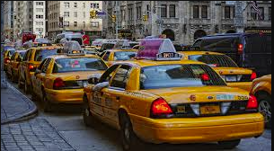

Welcome to the README for Group 4, Project 4!

This project looks at using machine learning to create predictive models of a 2016 New York City taxi trip [dataset](https://www.kaggle.com/competitions/nyc-taxi-trip-duration/overview). It uses a cleaned dataset from kaggle (discussed in Data section) to try to answer questions about hotspots for taxis (time and locations), as well as trying to predict the duration of trips.

This project contains an ETL section, where data is extracted transformed and loaded (see Data section). It contains a machine learning section, including clustering (for hot spots) and linear regression (for predicting trip duration) models. Finally in contains a neural network section (to predict trip duration).

## Data

The [dataset](https://www.kaggle.com/competitions/nyc-taxi-trip-duration/overview) for this project comes from a kaggle competition from 2016. The goal of the competition was to use machine learning to predict trip duration. The data from the kaggle page was cleaned and ready for machine learning. This dataset is very large with over 1.4 million rows!

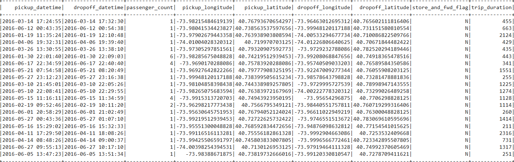

Initial investigation of the data showed that it might be possible to create an updated 2024 file. The 2024 data is all available at the NYC TLC site [here](https://www.nyc.gov/site/tlc/about/tlc-trip-record-data.page). The first few days of the project were spent creating an ETL pipeline to extract, transform, and load the 2024 yellow taxi ride data. Images of the process follow:

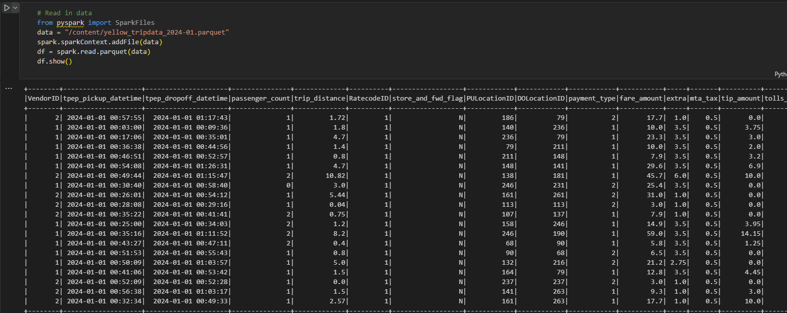

(Above: January 2024 Yellow Cab Trip Data `parquet` file loaded into a spark data frame)

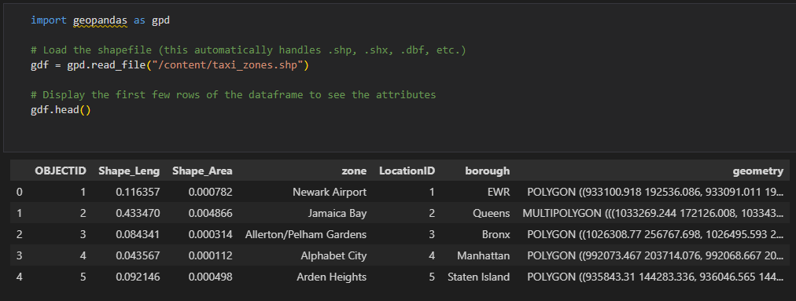

(Above: Yellow Taxi `shapefile` loaded into geo data frame, note Geometry polygons for neighborhood zones)

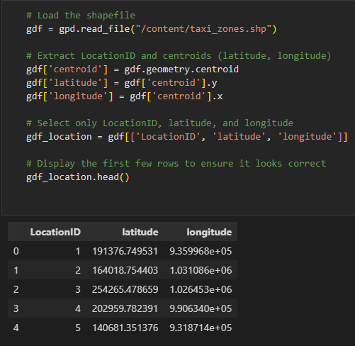

(Above: Extracting centroid of polygon - the middle of the neighborhood in a single point.)

Ultimately, it was observed that the process was flawed, and the cleaned data from the 2016 competition contained supplemental information that was not publicly available on either kaggle or the NYC taxi site. The clean kaggle data from the competition contained exact coordinates for taxi rides, whereas the publicly available data from NYC TLC only contained information about the neighborhood of the rides (no precise coordinates).

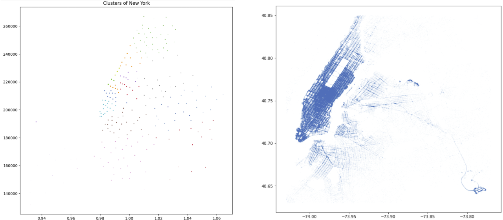

(Above Left: 2024 with neighborhood centroid data)								  (Above Right: 2016 clean kaggle data, visualized by Omri Goldstein [here](https://www.kaggle.com/code/drgilermo/dynamics-of-new-york-city-animation), see References)

The original clean kaggle 2016 dataset was stored in a `s3` bucket to make access easier across machines [https://project4-nyctaxi.s3.us-east-1.amazonaws.com/train.csv&#39;]('https://project4-nyctaxi.s3.us-east-1.amazonaws.com/train.csv').

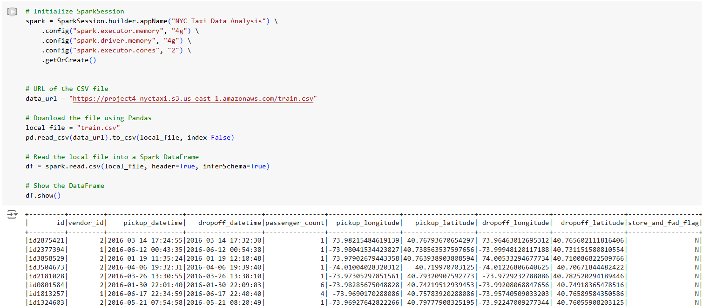

## Methodology

Once the ETL process was complete (the full process is documented in `project4_ETL.ipynb`) work on creating machine learning models could begin. Many different models were created and visualized including (but not limited to): RandomForest, KMeans, PCA, Linear Regression, among others. Valuable insight and investigation can be gleaned from these models. They can be found in `ml_1.ipynb` and `ml_2.ipynb`:

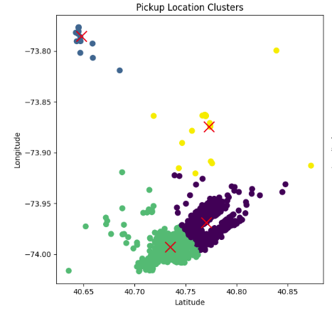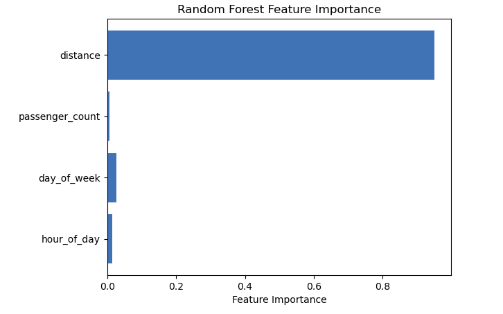

Next an attempt at a predictive neural network. This was done over many files. However the progression can be viewed from `nn_model_stage1.ipynb`, `nn_model_stage3.ipynb`, and finally `nn_model_optimization_full.ipynb`.

The first attempt at a neural network was done as a proof of concept on a local machine in the file `nn_model.ipynb`. This proved that it was possible and that the features of this dataset could indeed be trained to predict the target (trip duration). The results of this model were not great; the R-squared value wasn't even calculated, however the MAE of the model was about 564 seconds (about 9.4 minutes).

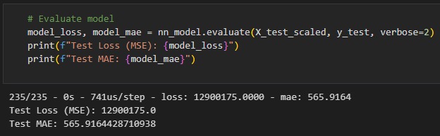

The next attempt at a deep neural network was down exclusively with Pyspark on Colab. This model can be found in `nn_model_stage3`. This model has very similar hyperparameters to the following two. However, this model performed the worst of any of them. The proof of concept is there; then entire loading, preprocessing and model are done with Pyspark on Google Colab. The results were poor: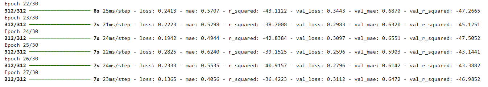

An R-squared value of -36% is very low. This means that the model predicts very poorly.

The next step was to try using Pandas on Google Colab, instead of spark, to run the neural network model. This was done after success with Pandas in testing on local machines. However, the results of the optimized neural network using Pandas Colab were not very good. The model could not do very well, even in its best iterations. The following is an image of the model at its peak (`nn_model_stage4.ipynb`):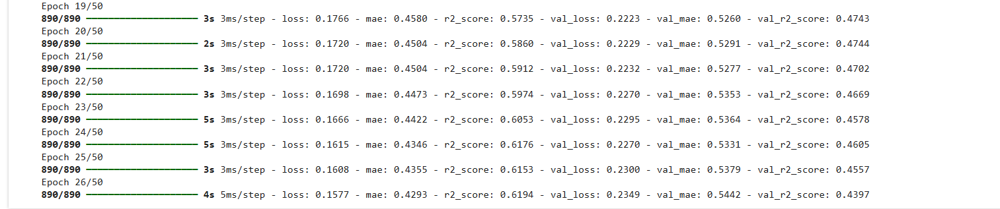

The R-squared value of 61% in the training was the absolute best the was achieved through optimization in Colab. However, when that model was evaluated with the test data the results were dismal:

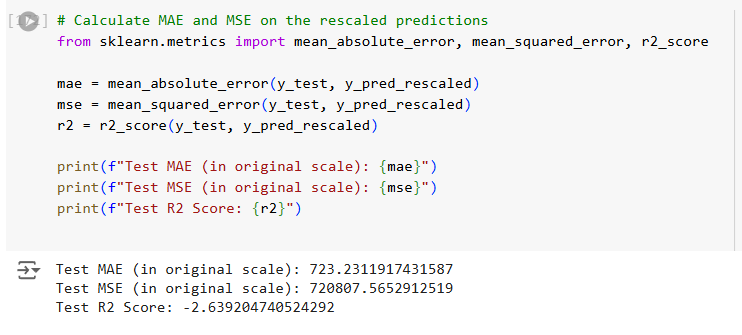

The mean average error here is 723 seconds (that's about 12 minutes). That is not a very estimate for trip duration. Even worse is the R2 score of -2.63%, that's worse than predicting using only the mean of the target variable. The mean squared error is 720,807 indicating a huge variance between predictions and actual values. This model was essentially a failure.  After failing to create a predictive model on Google Colab (with Spark or Pandas), the strategy shifted to creating a model on local machines using Pandas.

Some research, investigation, and testing has shown that perhaps running neural networks on Google Colab was not the best choice. Google Colab can throttle resources and be unreliable for large tasks with large datasets. When running the model on a local machine the difference was immediately noticeable.

The results of running the model on a local machine using Pandas follows in the Results section.

## Results

### Machine Learning Models

The results of the machine learning models in `ml_1.ipynb` and `ml_2.ipynb` show trends and outliers in the data. Take for example the linear regression in `ml_1` here:

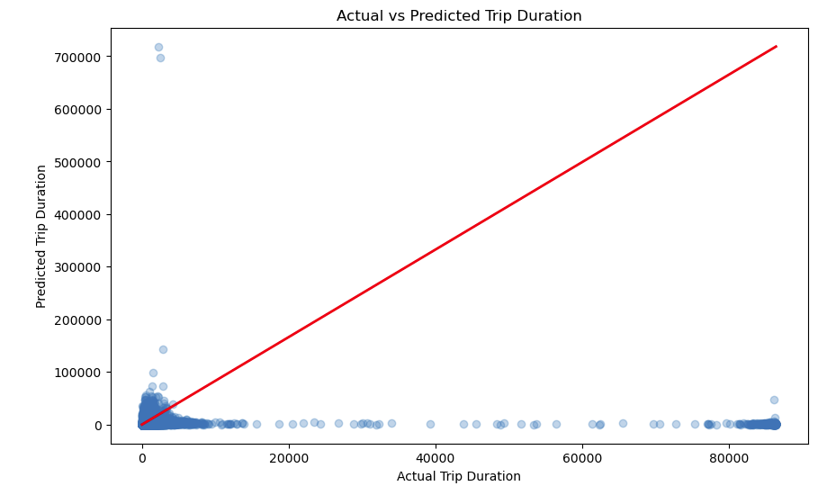

This clearly shows some obvious clusters and outliers. Most trips in the data are less than 5,000 seconds long. However, there are many outliers and even an irregular cluster of durations above 80,000 seconds (more than 20 hours). This seems extremely unlikely for regular taxi traffic.

Next, PCA was used to get an idea of these clusters. The PCA model indeed shows clear groups or clusters of features. Although PCA can be a little opaque (it's not clear exactly which features are being included here), it's helpful to know that these clusters exist. It confirms that this data is not normally distributed.

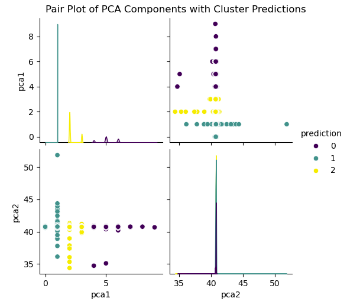

Next (in `ml_2.ipynb`), we can KMeans clusters of pickup and dropoff locations. These look quite a bit like the island of Manhattan and the surrounding area. There is a very high density of point in Manhattan, although there are noticeable clusters farther away. These are confirmed to be local airports JFK and LaGuardia; it makes sense that cabs drive to the airport. These airport clusters could be contributing to the outliers, although it does not take 20+ hours to drive to JFK from Manhattan.

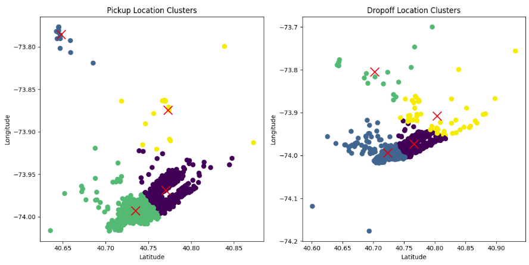

### Neural Network Model

The file `nn_model_optimization_full.ipynb` contains the neural network model that achieved the highest score upon evaluation. This model took over two hours to run. It was still improving when it stopped after 50 epochs. The results finally show a model that is capable of predicting trip duration with any amount of accuracy: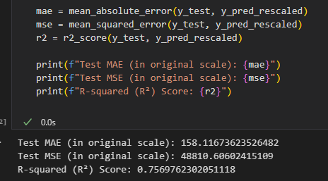

An R-squared value of ~76% during evaluation is far and away the best result after tuning three different models. The fitting of this model, as mentioned, took over two hours. With time considerations it was stopped after 50 epochs, however, it seems it could improve with more. The model was still gradually improving it's learning: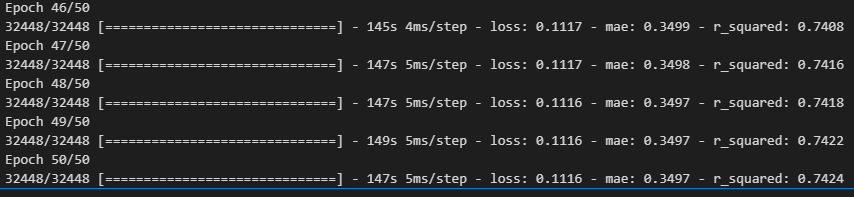

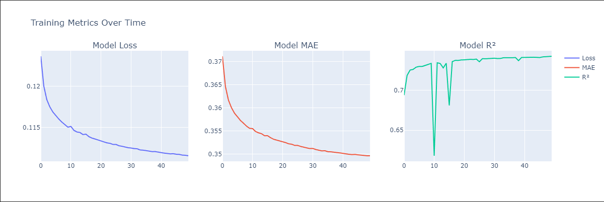

Notice the `r_squared` value is still gradually improving. It is reasonable to believe that given time this model could improve even more. The model was saved to the Output directory of the repo as `model.keras`.

## Conclusion

Using a big dataset it hard; this dataset had over 1.4 million rows. Numerous different strategies were used to wrangle this data, and surprisingly Pandas on a local machine performed the best. Google Colab, while a great resource, really struggled with creating a neural network.

The MAE (Mean Average Error) of the optimized neural network model (`nn_model_optimization_full.ipynb`) shows 158 seconds: that's about 2.6 minutes. That means that the model will be right at predicting within about 2-3 minutes. From an anecdotal standpoint, that's not so bad. Being able to predict the trip duration within about 2-3 minutes might be valuable for passengers and drivers.

As you can see in this heatmap, the model is more powerful in its predictions for certain durations:

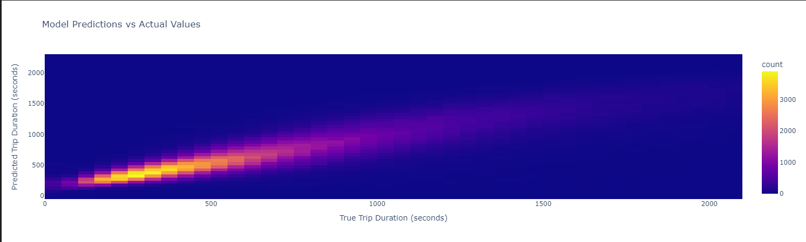

If the trip is very short or long the model will have difficulty predicting the trip duration. However, it does have a sweet spot that predicts well; trips between 500-100 seconds long (about 8-16 minutes) are predicted well. A lot of standard cab rides are around that length. This model is good at predicting normal short trip durations.

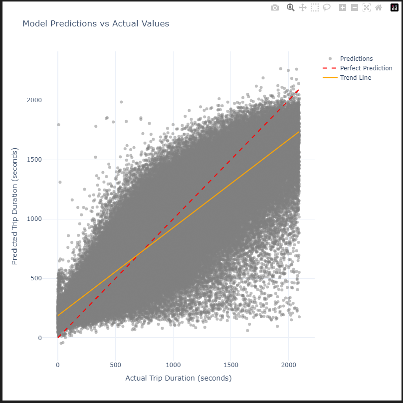

## References

Class materials were used extensively for this assignment, as well as:

* Stack Overflow. [https://stackoverflow.com](https://stackoverflow.com)
* Xpert Learning Assistant. [https://xpertlearningassistant.com](https://xpertlearningassistant.com)
* OpenAI. ChatGPT. [https://chat.openai.com](https://chat.openai.com)
* Kaggle. NYC Taxi Trip Duration Competition Overview. [https://www.kaggle.com/competitions/nyc-taxi-trip-duration/overview](https://www.kaggle.com/competitions/nyc-taxi-trip-duration/overview)
* Meg Risdal. New York City Taxi Trip Duration. https://kaggle.com/competitions/nyc-taxi-trip-duration, 2017. Kaggle.
* Omri Goldstein. Dynamics of New York city - Animation. https://www.kaggle.com/code/drgilermo/dynamics-of-new-york-city-animation, 2017. Kaggle

## Usage

Given the size of this project, one large script file is impractical. This repo contains several files (aside from the README) that document the process of this project. For ease of use the files are divided into folders for categories.

* ETL file:                           `ETL/`                        > `project4_ETL.ipynb`
* Machine Learning files:  `machine_learning/`   > `ml_1.ipynb`, `ml_2.ipynb`
* Neural Network files:     `nn_model/`                > `nn_model_stage1.ipynb`, `nn_model_stage2` , `nn_model_stage3.ipynb`, `nn_model_stage4`,  `nn_model_optimization_full.ipynb`
* Model Ouput file:	       `Output`                     > `model.keras`

The machine learning files are as follows:

* `ml_1` - Linear Regression, PCA, RandomForest
* `ml_2` - KMeans, XGBoost Regressor

The neural network files follow a path of optimization:

1. Initial phase:                          `nn_model_stage1.ipynb`
2. Pandas quick optimization:   `nn_model_stage2.ipynb`
3. Colab spark optimization:     `nn_model_stage3.ipynb`
4. Colab Pandas optimization:  `nn_model_stage4.ipynb`
5. Final Pandas optimization:    `nn_model_optimization_full.ipynb`

The fully optimized model file is available in the `Output/` directory: (`Output/model.keras`)

## Ethical Considerations

Data privacy is a consideration with this dataset. The pickup and drop-off locations could potentially be sensitive information. None of the passengers' personal information is available in the dataset. However, some of these data points could point to personal homes or other sensitive locations.

Using private data from NYC TLC should be done with careful consideration of ownership. This project will not be monetized in any way, and therefore falls within fair use. The data was also part of a kaggle competition and subject to any of the competition's applicable laws, rules, or regulations.
